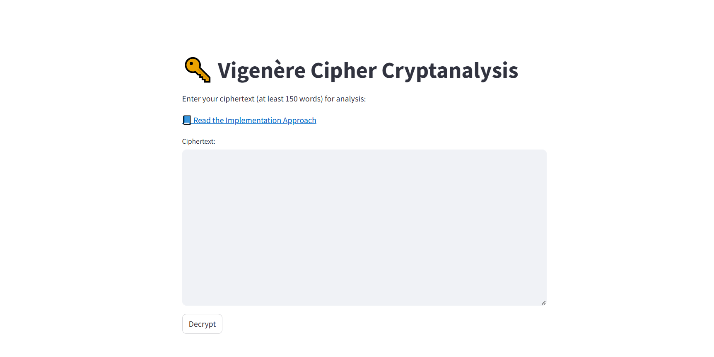
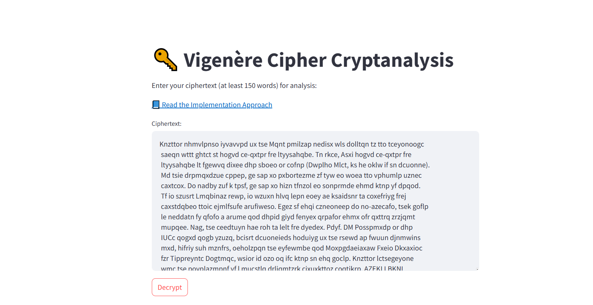
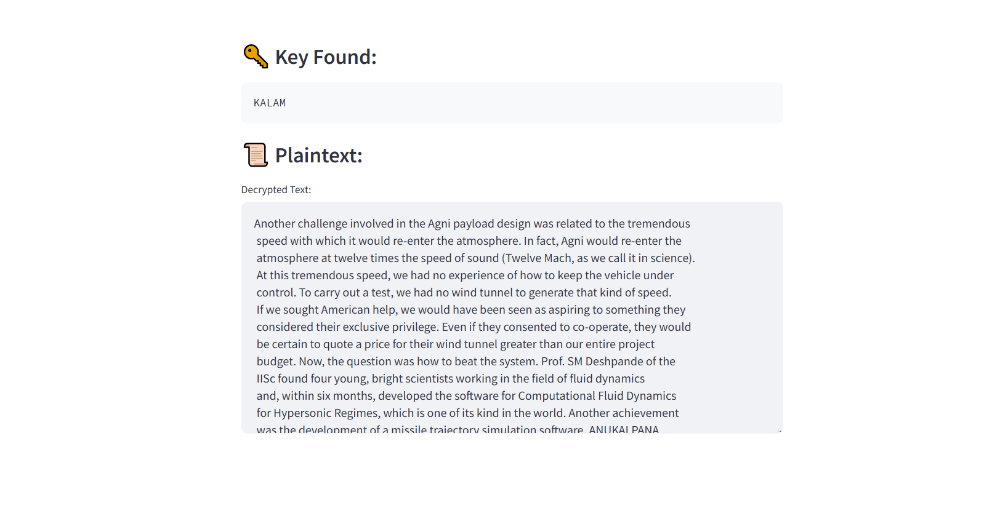

# 🔑 Vigenère Cipher Cryptanalysis

This repository contains an implementation of **Vigenère cipher cryptanalysis** using a hybrid statistical and dictionary-based approach. It includes:

* A **Streamlit frontend** for interactive use (`app.py`)
* A **cryptanalysis backend module** (`vigenere_final.py`)
* A detailed **report explaining the approach** ([📘 Report PDF](https://drive.google.com/file/d/18UYd2UuCJJzBnNh8M5GL_hygux_dYNiM/view?usp=sharing))


---

## Features

* **Preprocessing:** Cleans input to retain only A–Z characters.
* **Key Length Detection:** Uses a hybrid method combining **Kasiski examination** and **Index of Coincidence (IC)**.
* **Key Recovery:** Applies **Mutual Index of Coincidence (MIC)** to estimate relative shifts.
* **Candidate Scoring:** Evaluates decrypted plaintexts with:

  * Chi-squared test (letter frequency vs. English)
  * Dictionary scoring (common English words)
* **Weighted Normalization:** Logarithmic + min-max normalization ensures robust selection of the best candidate.
* **Frontend:** Streamlit app for uploading ciphertext and viewing results interactively.

---




---
## Running the Streamlit App

1. Install dependencies:

   ```bash
   pip install streamlit numpy
   ```

2. Run the app:

   ```bash
   streamlit run app.py
   ```

3. Enter your ciphertext (at least **150 words**) and click **Decrypt**.

---

## Report

For detailed methodology, challenges, and implementation notes, read the report:
[📘 Read the Implementation Approach](https://drive.google.com/file/d/18UYd2UuCJJzBnNh8M5GL_hygux_dYNiM/view?usp=sharing)

---


## 👨‍💻 Authors

* **Hrishikesh Bhat P**
* **Ayush Sonkar** 
